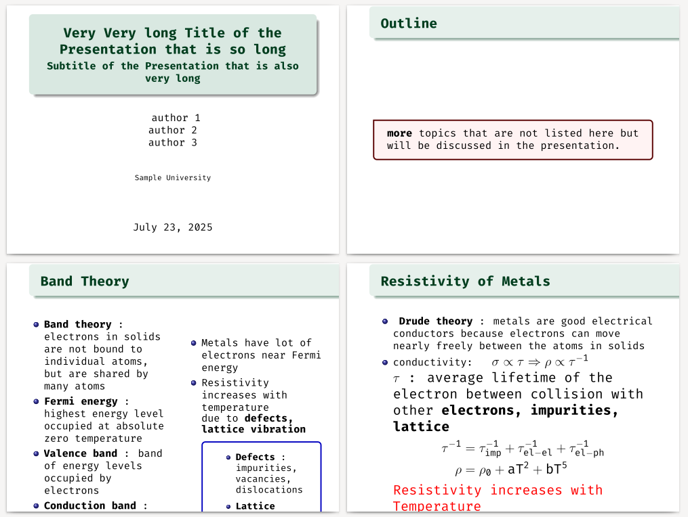

# Latex-templete
Style guide for latex  documents and beamer presentations. 

LaTeX is a powerful and flexible typesetting system used to create professional-quality documents and presentations. While it can seem challenging for beginners, understanding a few fundamental structures makes working with LaTeX much easier. With practice, you can efficiently produce well-formatted documents and slides. This repo come a very simple templete to make a
ppt.



## Beamer
Beamer is a latex package that allows you to create presentations.
It is similar to PowerPoint, but it uses LaTeX for typesetting.
(See [Beamer User Guide](https://ctan.org/pkg/beamer?lang=en) for more information.)

### dependencies 

- Fedora :
    Install these packages in Fedora or similar packages in other distro.
    `dnf install texlive-wasysym  texlive-tcolorbox tikzfill texlive-tikzfill texlive-wasy-type1.noarch texlive-wasysym.noarch`

#### Style Guide 

- Use `columns` environment to create columns in your slides.
    ```latex
        \begin{columns}
            \begin{column}{0.5\textwidth}
                % Left column content
            \end{column}
            \begin{column}{0.5\textwidth}
                % Right column content
            \end{column}
        \end{columns}
    ```
- Use `itemize` or `enumerate` environments for lists.
    ```latex
        \begin{itemize}
            \item First item
            \item Second item
        \end{itemize}
    ```
- Use `block, alertblock, exampleblock` for highlighting important information.
    ```latex
        \begin{block}{Block Title}
            Block content goes here.
        \end{block}
    ```
- use `includegraphics` to add images.
    ```latex
        \includegraphics[width=\textwidth]{image.png}
    ```
- use `tcolorbox` for colored boxes.
    ```latex
        \begin{tcolorbox}[colback=blue!5!white,colframe=blue!75!black]
            Tcolorbox content goes here.
        \end{tcolorbox}
    ```
- Use `checkboxes` and `xbox` for tasks or items.
	```latex		
	\begin{exampleblock}{Classical Model}
		\begin{itemize}
			\item $\CheckedBox$ Can explain bound state.
			\item $\CheckedBox$ Can explain spin-polarized STM
			\item $\XBox$ Kondo (quantum) effects ignored.
			\item $\XBox$ Internal degrees (spin, ..) are is ignored.
		\end{itemize}
	\end{exampleblock}
    ```		
- Add footnote using `footnote` command.
    ```latex
        This is a footnote\footnote{This is the footnote text.}.
    ```
- Use `hyperref` package for clickable links.
    ```latex
        \usepackage{hyperref}
        \href{https://example.com}{Click here}
    ```
- Add a thanks to end of slide 
    ```latex             
        \begin{frame}[plain]
            \begin{center}
                {\fontsize{50}{60}\selectfont \textbf{Thank You.}}
            \end{center}
        \end{frame}
    ```    


